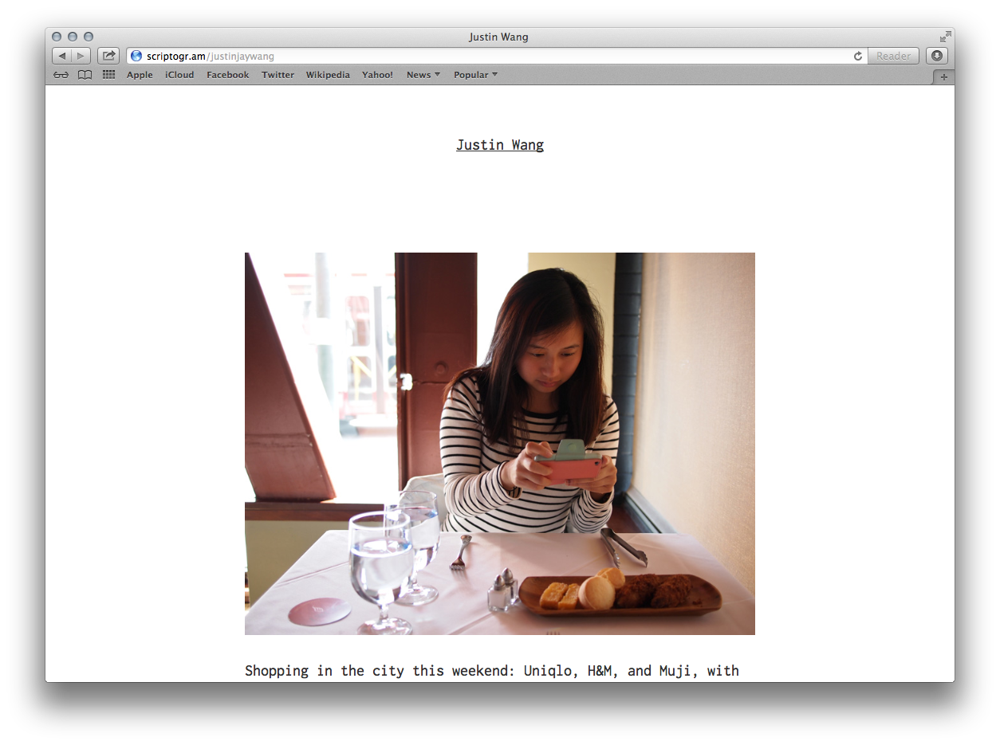
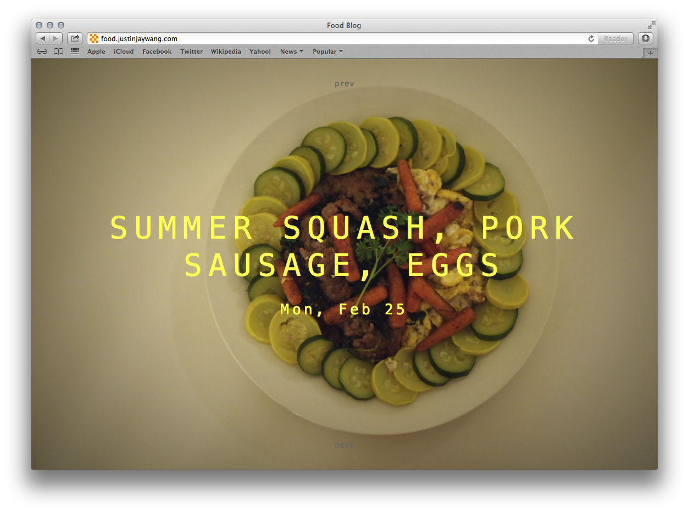
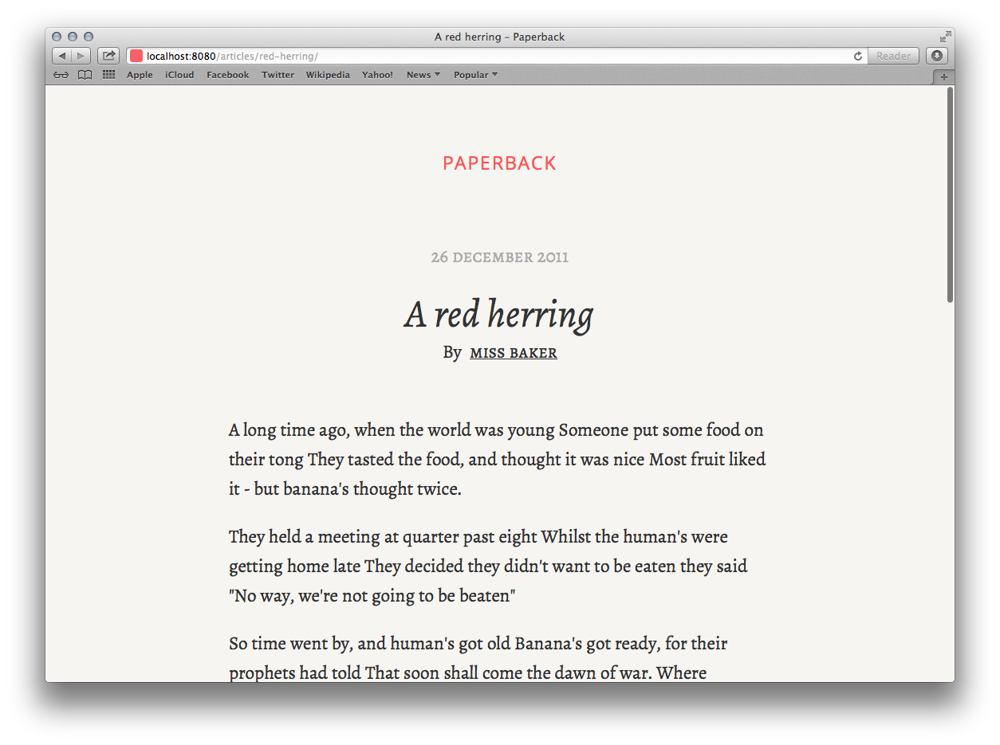

# Learnings
*Learnings for Feb 21–28.*

## iA's Oliver Reichenstein

I was really inspired to read a number of articles and interviews about Oliver Reichenstein (thanks for the tip, Scott), including [this one](http://www.theverge.com/2012/7/24/3177332/ia-oliver-reichenstein-writer-interview-good-design-is-invisible). Some thoughts and takeaways:

- **A minimal aesthetic** for screens is more usable and useful for getting information across. Ads/stakeholders often get in the way, though.
- **Readability of text on screens** in terms typography: line length, font size, [responsiveness](http://informationarchitects.net/blog/responsive-typography-the-basics/).
- **You learn so much, even as a design consultancy, from making your own product**, as iA did with iA Writer. For Vertigo, redesigning the website and other internal projects is great for learning. I wonder, though, if Vertigo has any plans to make their own product in the future.

## Stately

On Friday Feb 22, I made a simply proof of concept using [Stately](http://intridea.github.com/stately/), the symbol font. *Verdict?* It's kind of janky, with the way it displays each state as a letter in code (unsemantic). Also, you can't do much interactivity (like hover over one state) because all the states overlap each other on the screen.

## Markdown

I'm absolutely loving Markdown. I looked at two editors: [Mou](http://mouapp.com/) and [iA Writer](http://www.iawriter.com/mac/). I was so inspired by Oliver Reichenstein that I downloaded iA Writer on both my iPhone and MacBook.

### Mou

Great for previewing the generated Markdown (links, properly-sized headings), and even you can even provide your own stylesheets, export to HTML/PDF, or post to Tumblr or Scriptogr.am.

### iA Writer

Great for concentrated writing (no wonder so many professionals use it). You can also write from your iPhone with the iOS app and sync to iCloud or save to Dropbox.

### Conclusion
I think for long, extended writing I'll be using iA Writer, but for simple READMEs and general purpose writing I'll be using Mou. I'll save Sublime Text 2 for coding.

*Edit: Todd just told me of another great editor called [Live](http://markdownlive.com/).*

*Another edit: But then I found [this](http://www.techinasia.com/copycats-steal-design-chinesedeveloped-markdown-app/). Maybe a case that Live copied Mou.*

## Static site generators

I was primarily interested in two: [Scriptogr.am](http://scriptogr.am/about/), for generating simple blogs by reading Markdown files in a special Dropbox folder for the app, and [Wintersmith](http://jnordberg.github.com/wintersmith/), a node-based site generator.

### Scriptogr.am

On Friday Feb 22 and Monday, I set up a [pesonal blog](http://scriptogr.am/justinjaywang) on Scriptogr.am to try it out. It's responsive, with two breakpoints (iA-style). Uses the Google Web Font [Inconsolata](http://www.google.com/fonts/specimen/Inconsolata), which I love as a monospace font that looks good both in Mac and Windows. I like Menlo and Monaco, but those aren't on Windows.

It's still a work in progress, content-wise. I've stripped down the default theme in a custom, responsive theme with minimal styling for now, but I do have plans maintain this blog in the future.

#### Pros

- Super easy to set up (just need to sign in with Dropbox).
- Easy to manage (just drop your blog post Markdown files in the special Dropbox folder). Added bonus that the posts are already in your Dropbox so you can edit the files on any device.
- Mou, the Markdown editor detailed above, has a feature to publish to Scriptogr.am right from the editor.
- Also features a web interface for writing posts.

#### Cons

- Also features a web interface for writing posts.
- You have to go to your Scriptogr.am dashboard and hit a "Synchronize" button to sync up your Dropbox folder with their server. 
- Have to use their web interface for custom HTML and CSS themes, like Tumblr does. I just wrote the theme in Sublime Text 2 and then copy and paste into their web interface. But, on the bright side, it's not as buggy as that of Tumblr and is pretty fast.

### Wintersmith

Tuesday, Feb 26 I created a big photo [food blog](http://food.justinjaywang.com/) to try it out. 

Wintersmith is very customizable (just make your own stylesheet) and you can organize the site hierarchy however you want and add search functions for categorizing posts (by date for an archive, or by tags). That's how the [archive](http://food.justinjaywang.com/archive/) works.

#### Pros

- Uses Jade-based templates, and support for a bunch of other templating engines through [plugins](https://github.com/jnordberg/wintersmith/wiki/Plugins).
- Under active development.
- Very easy to set up and get a "Hello World" blog (or other website) up and running.
- RSS feed included.

#### Cons

- It's a minor detail, but to get rid of ".html" in the URL for blog permalinks, I had to either (1) use .htaccess to rewrite URL or (2) put the Markdown file in a subfolder inside the posts folder and name it "index.md" as they did in their example. This might be the case for all static site generators, though, because the sites, after all, are just static.

## Wintersmith template

On Wednesday Feb 27 I read more iA posts, such as [Improving the Digital Reading Experience](http://informationarchitects.net/blog/Improving-the-Digital-Reading-Experience/), to inform my eventual template/theme.

It talks a lot about analog versus digital experiences. For my theme I was inspired by printed books. I explored a lot of Google Web fonts to find a good typeface (it was between [PT Serif](http://www.google.com/fonts/specimen/PT+Serif), which also features a caption variant, and [Alegreya](http://www.google.com/fonts/specimen/Alegreya), which has a small caps variant). I ended up using Alegreya, which has more of an old-style flavor.

On Thursday Feb 28 I actually created the site, with the help of the Wintersmith [Stylus plugin](https://github.com/jnwng/wintersmith-stylus). It actually ended up looking a lot like iA's site. I'm not surprised, since I was so inspired by their design principles.

## MSRD Map

On Friday Mar 1, I started to read about [Fusion Tables](http://support.google.com/fusiontables/answer/2571232?hl=en&ref_topic=1652595).

---
*This document was composed in iA Writer and Mou.*