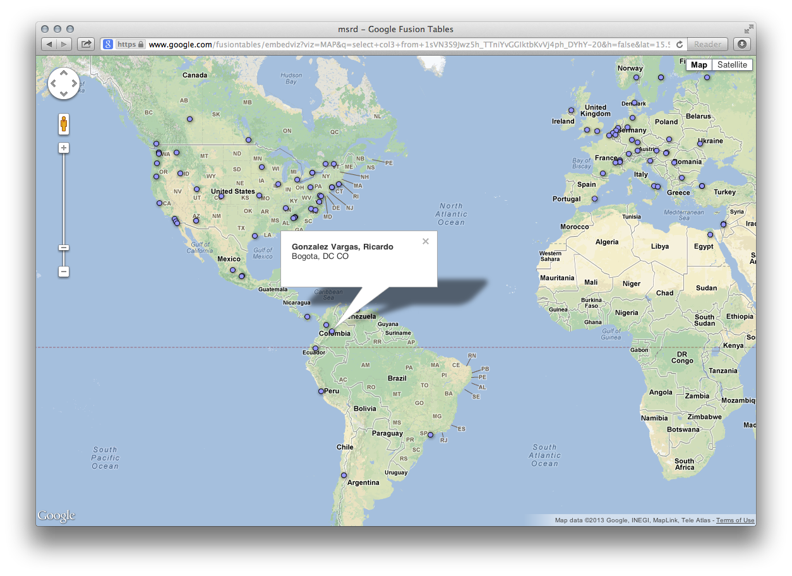
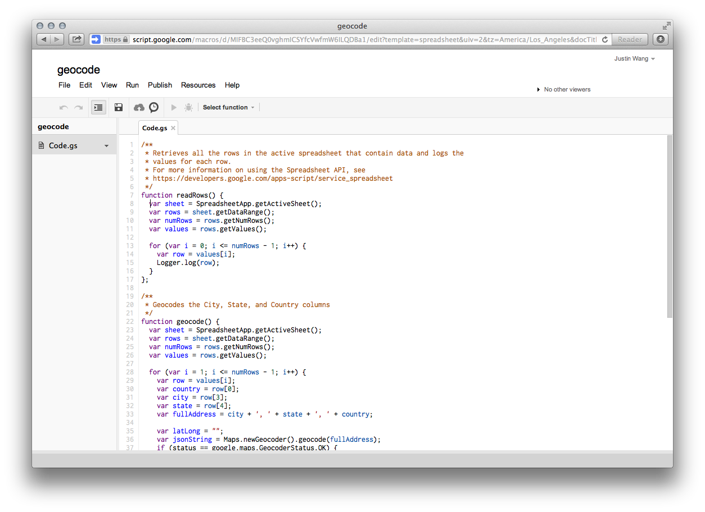
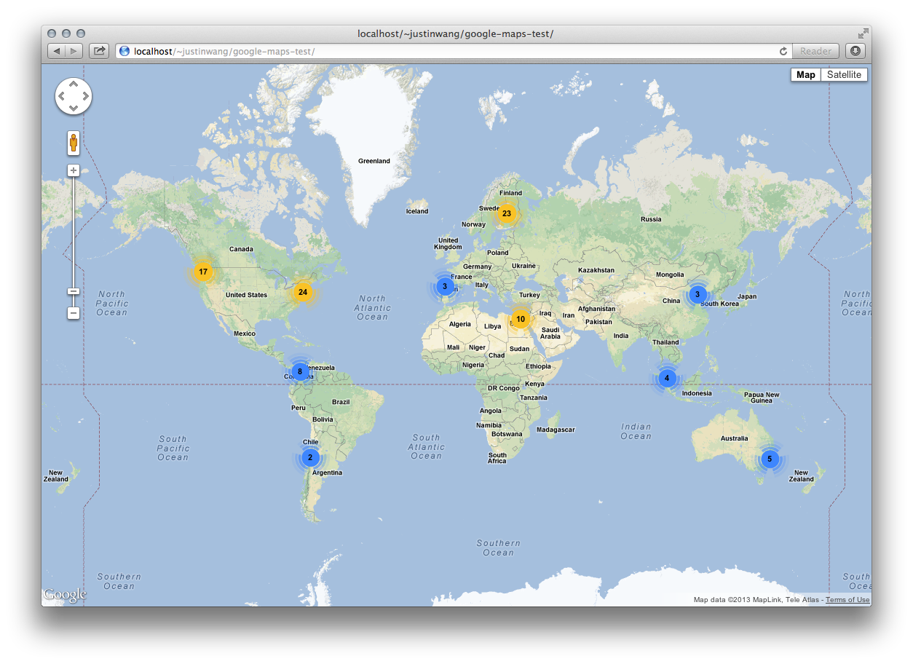
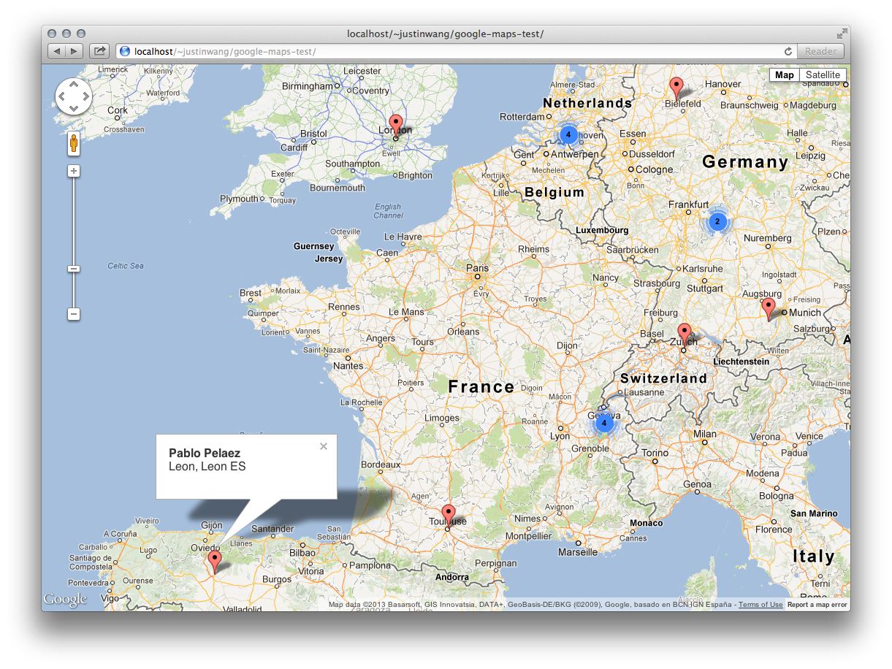

# Learnings
*Learnings from Mar 5: displaying Microsoft Regional Directors data in an easily-maintained, clustered map.*

## Simple map with Google Fusion Tables

As [@cherylaimee](https://github.com/cherylaimee) had done previously, I imported the Regional Director data into a Google Spreadsheet, and then created a new [Fusion Table](http://support.google.com/fusiontables/answer/2571232?hl=en) that imports the Google Spreadsheet. I was able to get a simple [map](https://www.google.com/fusiontables/embedviz?viz=MAP&q=select+col3+from+1sVN3S9Jwz5h_TTniYvGGIktbKvVj4ph_DYhY-20&h=false&lat=15.568154790235885&lng=-56.14238&z=3&t=1&l=col3&y=2&tmplt=3) of the cities up and running with little effort, and with some formatting, created nice "[business cards](https://www.google.com/fusiontables/embedviz?viz=CARD&q=select+*+from+1sVN3S9Jwz5h_TTniYvGGIktbKvVj4ph_DYhY-20+order+by+col0+asc&tmplt=4&cpr=4)" as a way to view and edit the data.

## Geocoding with a Google Apps Script

Since latitude and longitude are needed to work with the Google Maps API (which is needed eventually to cluster the locations), I wrote a [Google Apps script](https://developers.google.com/apps-script/) that [geocodes](https://developers.google.com/apps-script/class_geocoder) the address given in the Google Spreadsheet (city, state, country) and adds the value into the spreadsheet as (*latitude*, *longitude*).

Now, rather than have the default geocoded Fusion Table locations (which wasn't entirely accurate), you can then specify the location column in the Fusion Table as type "location", and have the Fusion Table map use the "location" column. For instance, compare the data from the first [Fusion Table map](https://www.google.com/fusiontables/embedviz?viz=MAP&q=select+col3+from+1sVN3S9Jwz5h_TTniYvGGIktbKvVj4ph_DYhY-20&h=false&lat=15.568154790235885&lng=-56.14238&z=3&t=1&l=col3&y=2&tmplt=3), which uses the geocoded city, and the [script-geocoded map](https://www.google.com/fusiontables/embedviz?viz=MAP&q=select+col5+from+1sVN3S9Jwz5h_TTniYvGGIktbKvVj4ph_DYhY-20&h=false&lat=39.07413851881222&lng=-77.66656606250001&z=4&t=1&l=col5&y=2&tmplt=3). The difference might be that the script uses the full address (*city*, *state*, *country*), whereas the Fusion Table only has the *city* column.

## Fusion Table in Google Maps, without clustering

You can render data contained in Fusion Tables in a [layer](https://developers.google.com/maps/documentation/javascript/layers#FusionTables), which improves performance because rendering is done on Google's servers rather than user's browsers. This is pretty easily done, but it wasn't possible to get the Fusion Table layer to cluster markers, so another method was needed.

## Fusion Table in Google Maps, with clustering

I figured I'd have to use [MarkerClusterer](http://gmaps-utility-library.googlecode.com/svn/trunk/markerclusterer/1.0/docs/reference.html) to have clustering functionality, as recommended by Google in [this article](https://developers.google.com/maps/articles/toomanymarkers).

MarkerClusterer requires location data of latitude and longitude, so I used [ft2json](http://ft2json.appspot.com/), a client-side Javascript API, to query the Fusion Table and receive a json output. I was then able to create a marker object for each director (with latitude and longitude, name, human-friendly location) and pass an array of all the marker objects as input to the MarkerClusterer object.

I added an [info window](https://developers.google.com/maps/documentation/javascript/overlays#InfoWindows), which shows director details when you click on a map pin.

