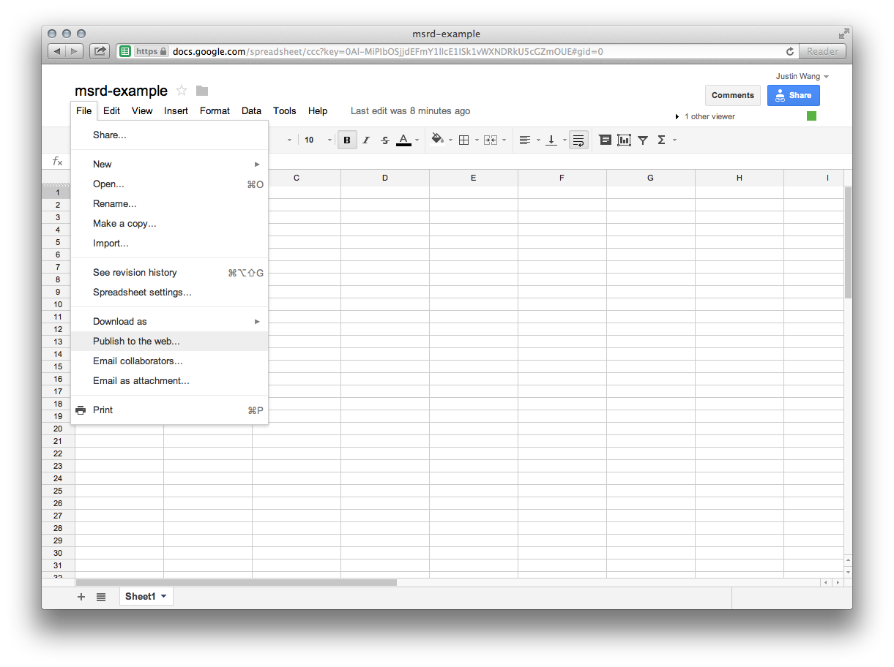
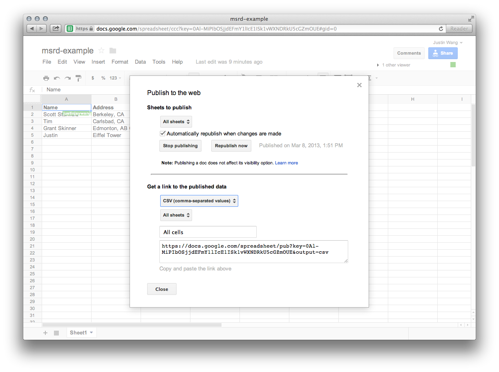

# Learnings
*Learnings for Mar 8: changing `geocode.js` script to read off Google Spreadsheet instead of local CSV file.*

## Google Spreadsheets API

The RDs would edit a Google Spreadsheet of their name and address, instead of editing a local CSV file. To start testing, I made a [sample Google Spreadsheet](https://docs.google.com/spreadsheet/ccc?key=0Al-MiPIbOSjjdEFmY1lIcE1ISk1vWXNDRkU5cGZmOUE#gid=0) with just "Name" and "Address" columns, which is what we eventually want.

### Google Spreadsheet directly to JSON

I looked at the [Google Spreadsheets API](https://developers.google.com/google-apps/spreadsheets/) and how to retreive [JSON feeds](https://developers.google.com/gdata/samples/spreadsheet_sample), but ran into some trouble getting the feed; Google's [example](https://developers.google.com/gdata/samples/spreadsheet_sample) wasn't even working.

Update: I finally got it to work, but the JSON output format is really [not what we want](https://spreadsheets.google.com/feeds/list/0Al-MiPIbOSjjdEFmY1lIcE1ISk1vWXNDRkU5cGZmOUE/od6/public/basic?alt=json-in-script&callback=foo).

### Publish to CSV

Instead, the most elegant, logical solution is to have the Google Spreadsheet published to the web (there's a nice option for Spreadsheets to publish to various formats, including CSV [but not JSON]). And, you can set the option to have the spreadsheet republished automatically when changes are made, while keeping access to the spreadsheet private (if desired).





#### Converting to CSV

You can generate a link to the data published as a CSV; if you visit this link in the browser, the [CSV file](https://docs.google.com/spreadsheet/pub?key=0Al-MiPIbOSjjdEFmY1lIcE1ISk1vWXNDRkU5cGZmOUE&output=csv) will be downloaded. I originally tried researching Node.js modules to perform an HTTP GET request on the url, but this was more complicated than it needed to be, since the URL is HTTPS, etc.

Good thing Scott is having me learn all these command line commands: I realized I can just `$ curl` the URL into a CSV file. I wrapped this command in `curl2csv.sh`.

```
curl 'https://docs.google.com/spreadsheet/pub?key=0Al-MiPIbOSjjdEFmY1lIcE1ISk1vWXNDRkU5cGZmOUE&output=csv' -o test.csv
```

#### Converting to JSON

The CSV file that's generated by Google almost the same as the format we assumed from before. For the original `geocode.js` script, we assumed a CSV like

```
name; address
Scott Stanfield; Berkeley, CA
Tim; Carlsbad, CA
Grant Skinner; Edmonton, AB CA
Justin; Eiffel Tower

```
, while the published CSV looks like

```
Name,Address
Scott Stanfield,"Berkeley, CA"
Tim,"Carlsbad, CA"
Grant Skinner,"Edmonton, AB CA"
Justin,Eiffel Tower
```
. I can just modify the original `geocode.js` script to account for these changes by splitting the lines by a comma delimiter (but [not including those in double quotes](http://stackoverflow.com/questions/11456850/split-a-string-by-commas-but-ignore-commas-within-double-quotes-using-javascript)) In the new `geocode.js`, the line

```
fields = line.split(';');
```

changes to

```
fields = line.match(/(".*?"|[^",]+)(?=\s*,|\s*$)/g);
```

.
